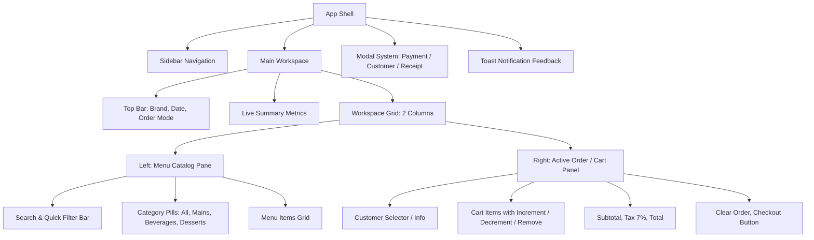
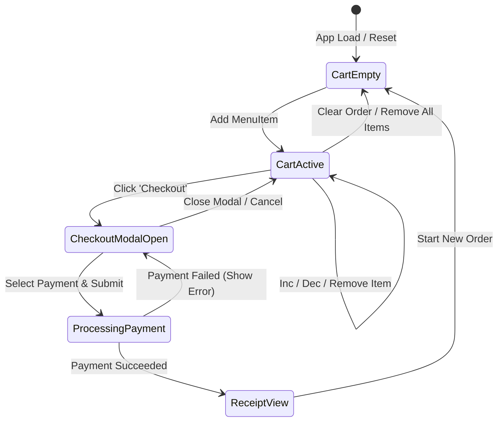

# Frontend UI Specification: Restaurant POS Web App

## 1. Overview & UI Objectives

The **Restaurant POS Web Application** provides a fast, intuitive, and touch-friendly point-of-sale interface for restaurant staff and cashiers. It translates the domain model ([`Restaurant`](file:///Users/mac/Desktop/workspace/Restaurant-POS/restaurant.py), [`Menu`](file:///Users/mac/Desktop/workspace/Restaurant-POS/menu.py), [`Order`](file:///Users/mac/Desktop/workspace/Restaurant-POS/orders.py), [`Payment`](file:///Users/mac/Desktop/workspace/Restaurant-POS/payment.py)) into a reactive, single-page application.

---

## 2. Component Hierarchy & Layout Structure

---

## 3. UI State Machine & Interaction Specifications

### State Rules & Invariants
1. **Empty Cart Invariant**:
   - When cart item count is `0`, the "Checkout" button **must be disabled**.
   - An empty state graphic and helpful text are displayed.
2. **Item Modification Invariants**:
   - Clicking a menu card adds 1 unit if not in cart, or increments quantity if already in cart.
   - Stepper `+` increments quantity by 1.
   - Stepper `-` decrements quantity by 1; if quantity is 1, decrementing or clicking trash removes the item.
   - Subtotal, Tax (7%), and Grand Total recalculate synchronously on any cart mutation.
3. **Dining Mode & Table Management**:
   - Toggle between **Dine-in** (with table selection: `T-01` through `T-06`, `VIP-01`) and **Takeaway**.
   - Dining mode and table assignment persist on the order and print on the final receipt.
4. **Customer Binding**:
   - Orders can have an assigned customer (Name & Phone) or default to "Walk-in Guest".
5. **Checkout & Payment Invariants**:
   - **Cash Tab**: Auto-focuses with pre-selected value for fast cashier input. Quick cash preset buttons (`Exact`, `฿100`, `฿500`, `฿1,000`). Validates `receivedAmount >= total`, computes change live.
   - **Credit Card Tab**: Validates card number to 16 digits (ignoring spaces and dashes). Masks display as `****-****-****-XXXX`.
   - **QR Code Tab**: Displays prompt QR code and auto-generates or verifies valid `transactionId`.
6. **Cashier Speed & Usability**:
   - **Keyboard Shortcuts**: `/` to focus search instantly, `Esc` to dismiss any dialog, `Enter` to confirm payment.
   - **Receipt Printing**: Dedicated `@media print` 80mm thermal receipt format.

---

## 4. UI Design System & Specifications

### Color Palette
- Primary Brand Accent: Forest Emerald `#1e6f49` / `#165337`
- Background: Off-white canvas `#f7f9f7`
- Surface Card: Pure White `#ffffff` with subtle borders `#e2e8e3`
- Text Primary: `#18221b`
- Text Muted: `#69756d`
- Status Colors:
  - Success / Confirmed: `#207a4d` (light badge: `#eaf5ee`)
  - Warning / Pending: `#b27400` (light badge: `#fef6e7`)
  - Destructive / Cancelled: `#c73838` (light badge: `#fbebeb`)

### Responsive Breakpoints
- **Desktop ($\ge 1024$px)**: 2-column layout (Menu grid $\sim 65\%$, Order panel $\sim 35\%$).
- **Tablet ($768$px - $1023$px)**: Adjusted columns with collapsible sidebar.
- **Mobile ($< 768$px)**: Single column with sticky bottom cart drawer or tab toggle.

---

## 5. API Endpoints Specification (Backend Sync)

When connected to the Python backend server:
- `GET /api/menu`: Returns list of menu items `[{id, name, price, category, image}]`.
- `POST /api/orders`: Initializes a new order for a customer.
- `POST /api/orders/:id/items`: Adds items `{menuItemId, quantity}`.
- `POST /api/orders/:id/checkout`: Validates and transitions order to `CONFIRMED`.
- `POST /api/orders/:id/pay`: Submits payment `{method: "cash"|"card"|"qr", amount, ...}` and completes order.
- `GET /api/orders`: Returns list of past orders with status and timestamps.

---

## 6. Frontend Acceptance Criteria (BDD)

### Feature 1: Menu Display and Filtering
- **Scenario 1.1**: Category filtering
  - **Given** menu items across categories "All", "Mains", "Drinks", "Desserts"
  - **When** the user clicks "Drinks"
  - **Then** only drink items are visible in the grid.
- **Scenario 1.2**: Search filtering
  - **Given** the search input is focused
  - **When** user types "Rice"
  - **Then** only items with "rice" in their name (case-insensitive) are displayed.

### Feature 2: Cart Operations
- **Scenario 2.1**: Adding item to cart
  - **Given** an empty cart
  - **When** user clicks the "Fried Rice" card
  - **Then** "Fried Rice" appears in cart with quantity 1 and checkout button becomes enabled.
- **Scenario 2.2**: Quantity decrement and removal
  - **Given** cart contains 1 "Iced Tea"
  - **When** user clicks the trash icon or decrements to 0
  - **Then** the item is removed and cart total adjusts to $0.00.

### Feature 3: Payment Validation & Checkout Flow
- **Scenario 3.1**: Cash payment underpayment block
  - **Given** cart total is $100.00 and Cash tab is active
  - **When** user enters received amount of $80.00
  - **Then** "Insufficient cash" warning appears and checkout completion is prevented.
- **Scenario 3.2**: Cash payment sufficient amount
  - **Given** cart total is $100.00
  - **When** user enters $120.00 and confirms
  - **Then** change of $20.00 is displayed, receipt view appears, and order is recorded as `COMPLETED`.
