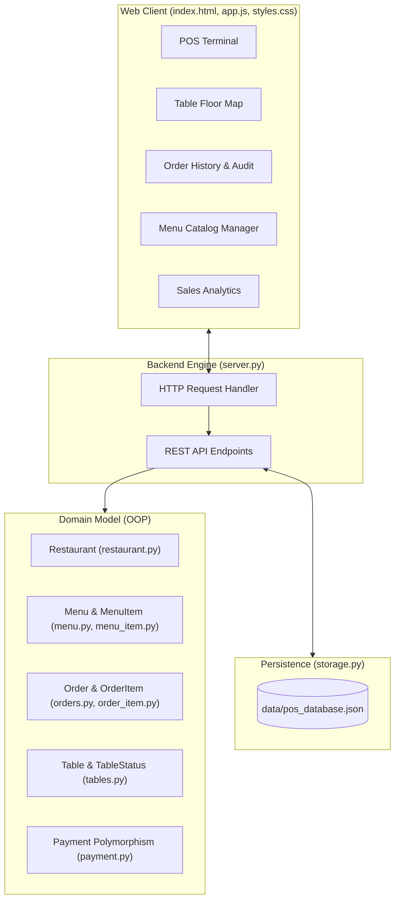

# 🍽️ TableOne Restaurant POS System

A modern, specification-driven Point of Sale (POS) and restaurant management platform built with Python and vanilla modern web technologies. Designed for speed, touch ergonomics, and operational resilience.

[](https://www.python.org/)
[](#-running-automated-tests)
[](SPECIFICATION.md)
[](#)

---

## 📑 Table of Contents
- [System Highlights](#-system-highlights)
- [Architecture Overview](#-architecture-overview)
- [Project Structure](#-project-structure)
- [Quick Start](#-quick-start)
- [Modules & Capabilities](#-modules--capabilities)
- [REST API Reference](#-rest-api-reference)
- [Running Automated Tests](#-running-automated-tests)
- [Specification Documents](#-specification-documents)

---

## 🌟 System Highlights

- **👥 Multi-Role Interface (Covers Every Restaurant Role)**:
  - 🧑‍💼 **Cashier / Waitstaff (FOH)**: Ultra-fast order entry, keyboard shortcuts (`/` search, `Esc`), cash change calculator, card/QR tender, thermal receipt printing, table seating.
  - 👨‍🍳 **Kitchen Staff (BOH / KDS)**: Real-time Kitchen Display System ticket board with station status (`Pending` -> `Cooking` -> `Ready` -> `Complete`), urgency timers, bump bar.
  - 👔 **Restaurant Manager**: Menu catalog CRUD (dish additions, category & pricing adjustments, deletions), daily sales KPIs, revenue analytics, bestsellers ranking.
  - 📱 **Customer Self-Order Kiosk**: Guest ordering mode with appetite food tiles, dining preferences, special cooking notes ("less spicy", "no ice"), and counter/QR dispatch.
- **⚡ Fast Cashier Operations**: Keyboard shortcuts (`/` for instant search, `Esc` to dismiss dialogs, `Enter` to confirm payment).
- **📱 Touch Ergonomic Design**: Generous $\ge 44\text{px}$ touch targets, visual cart steppers, and responsive layout for tablets and desktops.
- **🍽️ Dining Mode & Table Management**: Live floor map with table status (`Available` vs `Occupied`), guest capacities, and dine-in/takeaway toggles.
- **💳 Multi-Channel Polymorphic Payments**:
  - **Cash**: Quick bank note buttons (`Exact`, `฿100`, `฿500`, `฿1,000`) and live change computation.
  - **Credit Card**: 16-digit numeric card verification and `****-****-****-XXXX` masking.
  - **QR Code**: Digital wallet / PromptPay simulated authorization code.
  - **Pay at Counter**: Seamless bridge for customer kiosk orders.
- **🧾 Thermal Receipt Ready**: Dedicated `@media print` 80mm thermal receipt printing layout.
- **💾 Persistent JSON Database**: All orders, tables, customer profiles, and catalog edits persist across server restarts in `data/pos_database.json`.
- **📊 Real-Time Analytics**: Gross revenue, completed orders count, Average Order Value (AOV), and top-selling dishes breakdown.

---

## 🏛️ Architecture Overview



---

## 📂 Project Structure

```text
Restaurant-POS/
├── README.md                     # Master project documentation
├── SPECIFICATION.md              # Domain specification & contracts
├── FRONTEND_SPECIFICATION.md     # UI & interaction specification
├── server.py                     # Full-stack REST API server & static host
├── storage.py                    # JSON persistence layer
├── tables.py                     # Table & floor plan domain model
├── restaurant.py                 # Restaurant aggregate root
├── menu.py                       # Menu collection
├── menu_item.py                  # MenuItem entity
├── orders.py                     # Order entity & OrderStatus state machine
├── order_item.py                 # OrderItem value object
├── payment.py                    # Payment base class & payment strategies
├── customers.py                  # Customer entity
├── main.py                       # CLI demo entry point
├── index.html                    # Semantic HTML5 POS application
├── styles.css                    # Responsive styling & 80mm print rules
├── app.js                        # Reactive POS client engine
├── data/
│   └── pos_database.json         # Persistent JSON database
├── docs/
│   ├── ARCHITECTURE.md           # Deep-dive architectural specification
│   ├── API_DOCUMENTATION.md      # Complete REST API reference
│   └── USER_GUIDE.md             # Cashier & staff operational manual
└── tests/
    ├── __init__.py
    ├── test_menu_spec.py         # Menu CRUD unit tests
    ├── test_order_spec.py        # Order invariants & state machine tests
    ├── test_payment_spec.py      # Payment polymorphism tests
    ├── test_e2e_flow_spec.py     # End-to-end integration flow tests
    ├── test_server_spec.py       # REST API endpoint tests
    └── test_full_system_spec.py  # Full system & persistence tests
```

---

## 🚀 Quick Start

### 1. Requirements
- Python 3.9 or higher (standard library only, **no external dependencies required**).
- Any modern web browser (Chrome, Safari, Firefox, Edge).

### 2. Launch the POS Web Application
Run the built-in HTTP server:
```bash
python3 server.py
```

Then open your browser to:
👉 **[http://localhost:8000](http://localhost:8000)**

### 3. Run the CLI Demo (Optional)
To test the core domain models in terminal mode:
```bash
python3 main.py
```

---

## 🖥️ Modules & Capabilities

### 1. POS Order Terminal
- Instant search with category pills (`All`, `Mains`, `Drinks`, `Desserts`).
- Live order calculation: Subtotal + 7% VAT = Grand Total.
- Table selection (`Table 01` - `Table 06`, `VIP-01`) or Takeaway toggle.
- Customer binding (Walk-in, VIP Presets, or custom registration).

### 2. Order History & Audit Log
- Chronological list of orders with status badges (`PENDING`, `CONFIRMED`, `COMPLETED`, `CANCELLED`).
- Itemized receipt viewer with one-click **"🖨️ Print Receipt"** outputting an 80mm thermal format.

### 3. Table Floor Map
- Live status indicators (`Available` vs `Occupied`).
- One-tap seating and release, automatically synced with order checkouts.

### 4. Menu Catalog Manager
- Add new dishes with price and category.
- Delete discontinued items with immediate catalog update.

### 5. Sales Analytics & Reports
- Live Gross Revenue, Total Completed Orders, and Average Order Value (AOV).
- Ranked bestsellers list showing sales volume per dish.

---

## 📡 REST API Reference

| Method | Endpoint | Description |
| :--- | :--- | :--- |
| `GET` | `/api/menu` | List all menu catalog items |
| `POST` | `/api/menu` | Add a new menu item (`{name, price, category}`) |
| `DELETE` | `/api/menu/:id` | Remove a menu item by ID |
| `GET` | `/api/tables` | List all restaurant tables and occupancy |
| `POST` | `/api/tables/status` | Update table status (`{tableId, status}`) |
| `GET` | `/api/customers` | List registered customer profiles |
| `POST` | `/api/customers` | Register a new customer (`{name, phone}`) |
| `GET` | `/api/orders` | Retrieve full audit log of orders |
| `POST` | `/api/orders/checkout` | Process order checkout and payment |
| `GET` | `/api/reports/summary` | Retrieve sales analytics and bestsellers |

*For complete request/response schemas and examples, see [`docs/API_DOCUMENTATION.md`](docs/API_DOCUMENTATION.md).*

---

## 🧪 Running Automated Tests

The system includes 40 automated specification tests verifying state machines, payment algorithms, domain invariants, and API contracts.

Run the full test suite with standard library `unittest`:
```bash
python3 -m unittest discover -s tests -p "test_*.py" -v
```

### Test Output:
```text
Ran 40 tests in 1.240s

OK
```

---

## 📚 Specification Documents

- 📄 **[Domain & System Specification](SPECIFICATION.md)**: Class diagrams, state invariants, and BDD scenarios.
- 📄 **[Frontend UI Specification](FRONTEND_SPECIFICATION.md)**: Component hierarchy, touch interaction rules, and state machine.
- 📄 **[Architecture Deep-Dive](docs/ARCHITECTURE.md)**: Domain-driven design and structural patterns.
- 📄 **[API Documentation](docs/API_DOCUMENTATION.md)**: Complete REST API guide.
- 📄 **[User & Staff Guide](docs/USER_GUIDE.md)**: Cashier operating manual.
