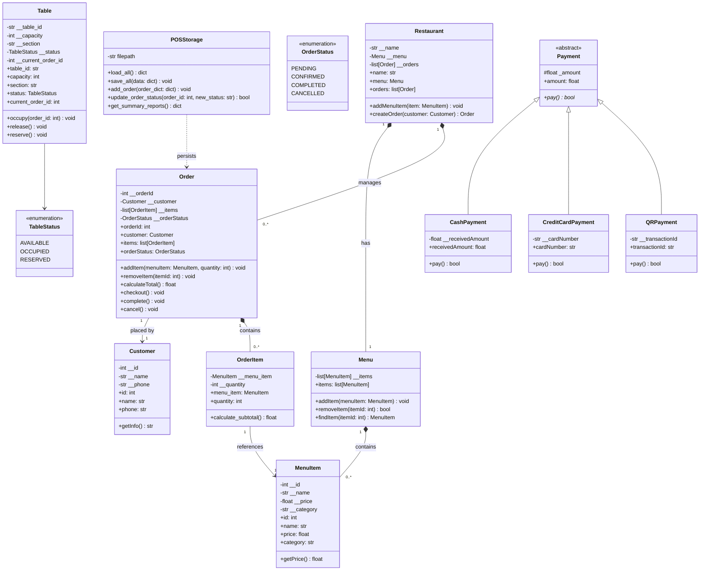
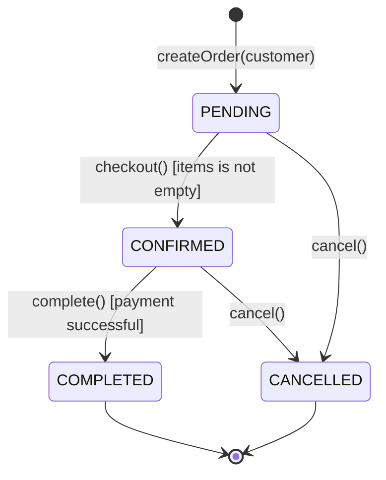
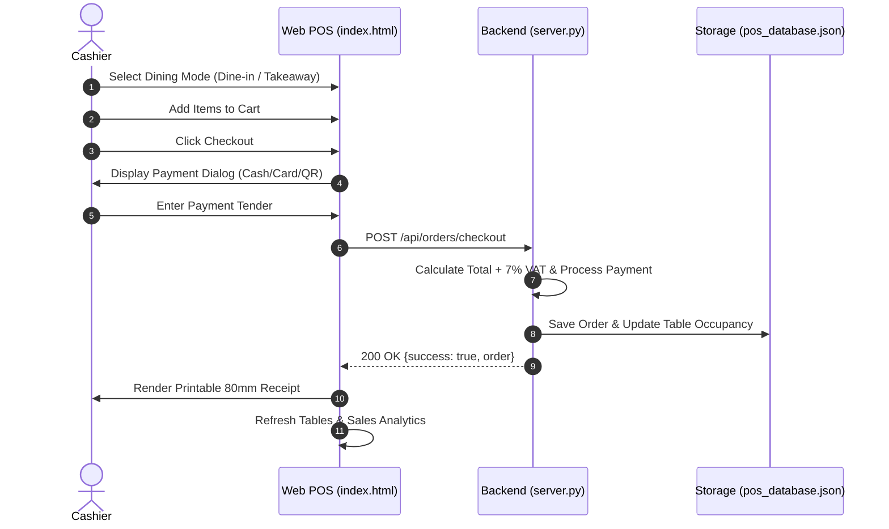

# Full System Specification: Restaurant Point of Sale (POS)

## 1. System Overview & Purpose

The **TableOne Restaurant POS System** is a full-stack, specification-driven point-of-sale platform. It connects restaurant floor operations, kitchen ticket workflows, table allocation, catalog management, and payment processing into a synchronized system.

---

## 2. Domain Model & Class Architecture

---

## 3. Order Lifecycle & State Machine Specification

### Invariant Rules
1. **Empty Cart Checkout Block**: An order cannot be checked out with zero items. Raises `ValueError("Order is empty")`.
2. **Post-Checkout Mutation Lock**: Once an order is checked out (`CONFIRMED`) or completed, no items can be added or removed.
3. **Quantity Invariant**: Item quantities must be positive integers (`quantity > 0`).
4. **Table Allocation Lock**: Occupying an already occupied table by a different order raises `ValueError`.

---

## 4. Payment Specifications & Polymorphism

| Payment Method | Required Fields | Verification Contract | Success Criteria |
| :--- | :--- | :--- | :--- |
| **Cash** | `amount`, `receivedAmount` | Evaluates received tender vs total owed; computes exact change. | `receivedAmount >= amount` |
| **Credit Card** | `amount`, `cardNumber` | Strips formatting; validates exactly 16 numeric digits; masks output `****-****-****-XXXX`. | `len(digits) == 16 and digits.isdigit()` |
| **QR Code** | `amount`, `transactionId` | Validates transaction ID non-empty and non-whitespace. | `bool(transactionId.strip())` |

---

## 5. Full REST API Specification

| Endpoint | Method | Payload / Params | Response | Description |
| :--- | :--- | :--- | :--- | :--- |
| `/api/menu` | `GET` | None | `list[MenuItem]` | Returns entire restaurant catalog. |
| `/api/menu` | `POST` | `{name, price, category}` | `MenuItem` (201) | Adds new dish to catalog & persistent DB. |
| `/api/menu/:id` | `DELETE` | Path `:id` | `{success: true}` (200) | Removes dish from menu. |
| `/api/tables` | `GET` | None | `list[Table]` | Returns all restaurant floor tables & statuses. |
| `/api/tables/status`| `POST` | `{tableId, status}` | `{success: true}` (200) | Updates table status (`available`/`occupied`). |
| `/api/customers` | `GET` | None | `list[Customer]` | Returns registered customer profiles. |
| `/api/customers` | `POST` | `{name, phone}` | `Customer` (201) | Registers customer profile. |
| `/api/orders` | `GET` | None | `list[Order]` | Returns full audit log of all orders. |
| `/api/orders/checkout` | `POST` | `{customerName, items, payment, diningMode, tableNumber}` | `{success, order}` (200) | Validates total, processes payment, persists order. |
| `/api/reports/summary` | `GET` | None | `{totalOrders, completedOrders, totalRevenue, popularItems}` | Real-time analytics report. |

---

## 6. End-to-End Sequence Flow

---

## 7. Automated Test Suite (40 Specification Tests)

All 40 acceptance criteria are validated automatically with `python3 -m unittest discover -s tests`:
- [`tests/test_menu_spec.py`](file:///Users/mac/Desktop/workspace/Restaurant-POS/tests/test_menu_spec.py): Menu addition, removal, and lookup specs.
- [`tests/test_order_spec.py`](file:///Users/mac/Desktop/workspace/Restaurant-POS/tests/test_order_spec.py): Order calculation, mutation guards, and state machine invariants.
- [`tests/test_payment_spec.py`](file:///Users/mac/Desktop/workspace/Restaurant-POS/tests/test_payment_spec.py): Cash, Card, and QR payment contracts.
- [`tests/test_e2e_flow_spec.py`](file:///Users/mac/Desktop/workspace/Restaurant-POS/tests/test_e2e_flow_spec.py): End-to-end integration workflows.
- [`tests/test_full_system_spec.py`](file:///Users/mac/Desktop/workspace/Restaurant-POS/tests/test_full_system_spec.py): Table allocation, persistence, menu CRUD, and report analytics.
- [`tests/test_server_spec.py`](file:///Users/mac/Desktop/workspace/Restaurant-POS/tests/test_server_spec.py): REST API contracts.
