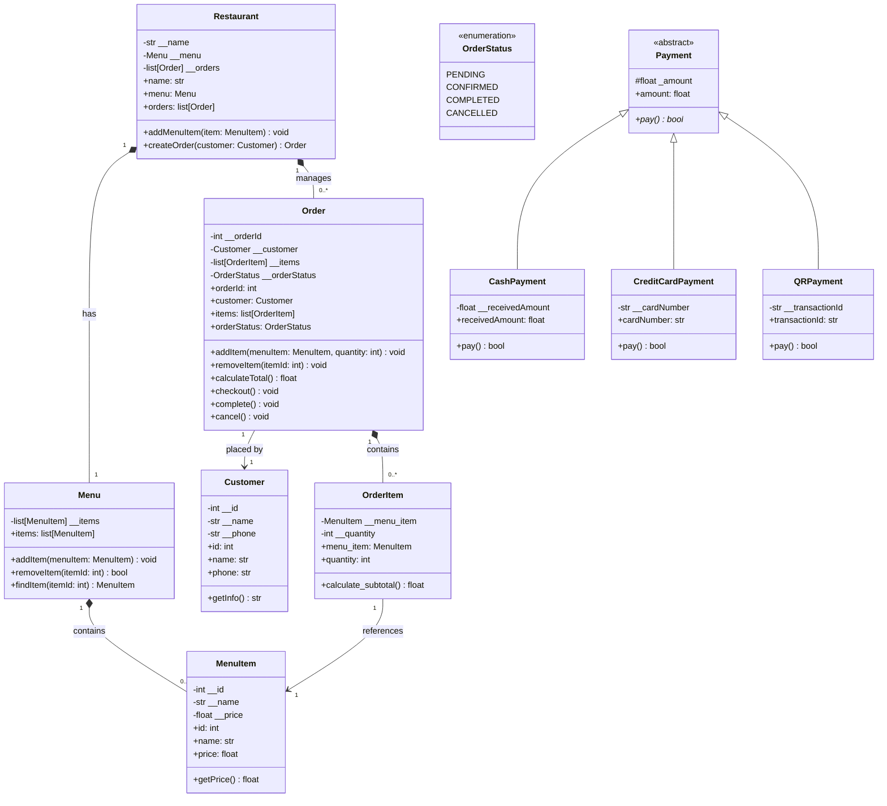
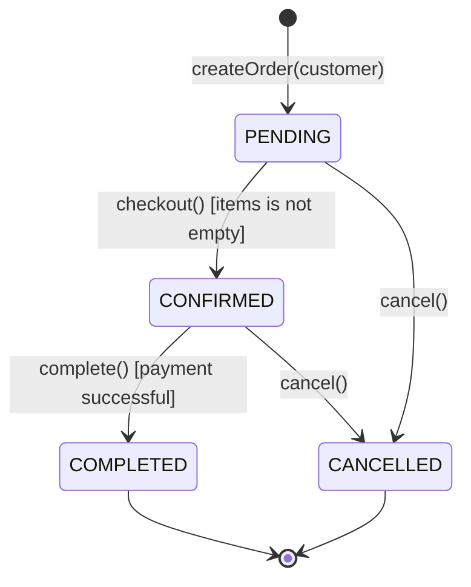
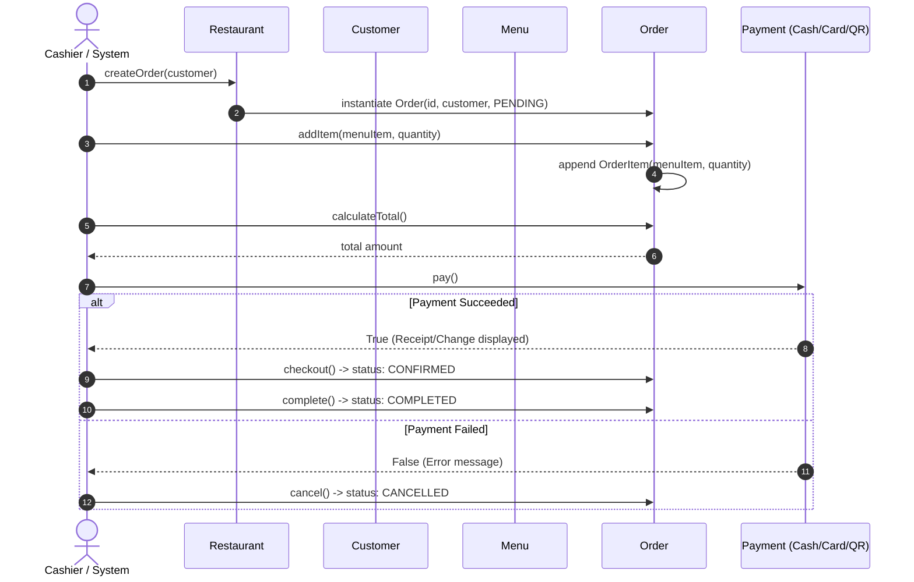

# System Specification: Restaurant Point of Sale (POS)

## 1. System Overview & Purpose

The **Restaurant POS System** is an object-oriented point-of-sale domain model designed to handle customer orders, menu catalog management, bill calculation, and multi-channel payment processing (Cash, Credit Card, and QR Code).

---

## 2. Domain Model & Class Architecture

---

## 3. Order Lifecycle & State Machine Specification

### State Transition Invariants
1. **`PENDING` $\to$ `CONFIRMED` via `checkout()`**:
   - **Pre-condition**: Order items list must not be empty (`len(items) > 0`).
   - **Pre-condition**: Current status must be `OrderStatus.PENDING`.
   - **Post-condition**: Status changes to `OrderStatus.CONFIRMED`.
   - **Error Handling**: Raises `ValueError("Order is empty")` or `ValueError("Order cannot be checked out")`.

2. **`CONFIRMED` $\to$ `COMPLETED` via `complete()`**:
   - **Pre-condition**: Current status must be `OrderStatus.CONFIRMED`.
   - **Post-condition**: Status changes to `OrderStatus.COMPLETED`.
   - **Error Handling**: Raises `ValueError("Order must be confirmed first")` if invoked in any other state.

3. **Any non-completed state $\to$ `CANCELLED` via `cancel()`**:
   - **Pre-condition**: Current status must **not** be `OrderStatus.COMPLETED`.
   - **Post-condition**: Status changes to `OrderStatus.CANCELLED`.
   - **Error Handling**: Raises `ValueError("Completed order cannot be cancelled")` if order is already completed.

4. **Order Mutation Invariants (`addItem`, `removeItem`)**:
   - **Pre-condition**: Order status must be strictly `OrderStatus.PENDING`. Cannot mutate items once checked out, completed, or cancelled.
   - **Quantity Invariant**: Item quantity must be an integer strictly greater than zero (`quantity > 0`). Raises `ValueError` otherwise.

---

## 4. Payment Specifications & Subtype Polymorphism

All payment methods inherit from the abstract base class `Payment` and implement `pay() -> bool`.

| Payment Type | Required Fields | Validation & Execution Rule | Success Condition |
| :--- | :--- | :--- | :--- |
| **CashPayment** | `amount: float` `receivedAmount: float` | Compares received cash to total owed. Computes change: `receivedAmount - amount`. | `receivedAmount >= amount` |
| **CreditCardPayment** | `amount: float` `cardNumber: str` | Strips whitespace/hyphens. Checks for exactly 16 numeric digits. Masks card (`****-****-****-XXXX`). | `len(cleaned) == 16 and cleaned.isdigit()` |
| **QRPayment** | `amount: float` `transactionId: str` | Validates transaction ID non-empty and non-whitespace. | `bool(transactionId.strip())` |

---

## 5. End-to-End Sequence Flow

---

## 6. Specification-Driven Acceptance Criteria (BDD / Test Matrix)

### Feature 1: Menu Management
- **Scenario 1.1**: Adding item to menu
  - **Given** an empty Menu
  - **When** `addItem(MenuItem(1, "Fried Rice", 60.00))` is called
  - **Then** `findItem(1)` returns the item and `items` count equals 1.
- **Scenario 1.2**: Removing existing item
  - **Given** a Menu with item ID 1
  - **When** `removeItem(1)` is called
  - **Then** method returns `True` and `findItem(1)` returns `None`.

### Feature 2: Order Computation
- **Scenario 2.1**: Subtotal calculation
  - **Given** a `MenuItem` with price 60.00 and quantity 2
  - **When** `calculate_subtotal()` is called on `OrderItem`
  - **Then** subtotal is `120.00`.
- **Scenario 2.2**: Order total calculation
  - **Given** an Order with 2 Fried Rice (60.00 ea) and 1 Iced Tea (25.00 ea)
  - **When** `order.calculateTotal()` is executed
  - **Then** total is `145.00`.

### Feature 3: Order State Enforcement
- **Scenario 3.1**: Empty order checkout rejection
  - **Given** an order with 0 items
  - **When** `order.checkout()` is called
  - **Then** `ValueError("Order is empty")` is raised.
- **Scenario 3.2**: Direct completion rejection
  - **Given** an order in `PENDING` status
  - **When** `order.complete()` is called
  - **Then** `ValueError("Order must be confirmed first")` is raised.
- **Scenario 3.3**: Completed order cancellation rejection
  - **Given** an order in `COMPLETED` status
  - **When** `order.cancel()` is called
  - **Then** `ValueError("Completed order cannot be cancelled")` is raised.

### Feature 4: Payment Verification
- **Scenario 4.1**: Insufficient cash payment
  - **Given** total amount `100.00` and cash received `80.00`
  - **When** `CashPayment.pay()` is called
  - **Then** returns `False`.
- **Scenario 4.2**: Valid credit card
  - **Given** card number `"1234-5678-9012-3456"` and amount `100.00`
  - **When** `CreditCardPayment.pay()` is called
  - **Then** returns `True` and logs masked card number.
