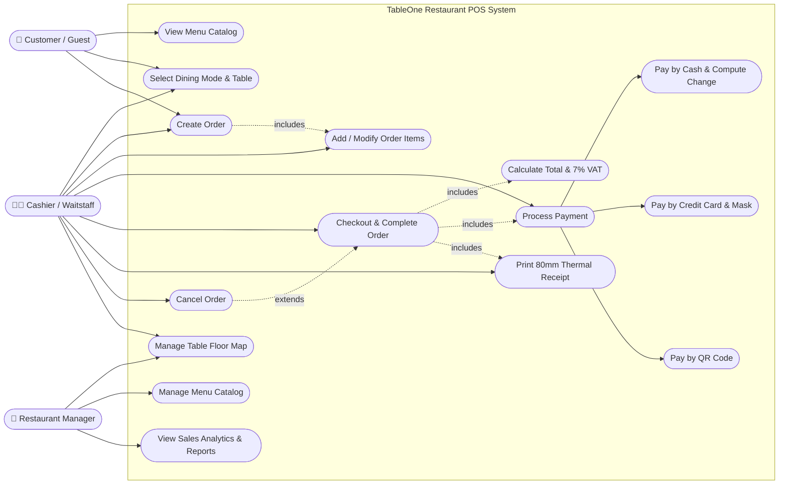
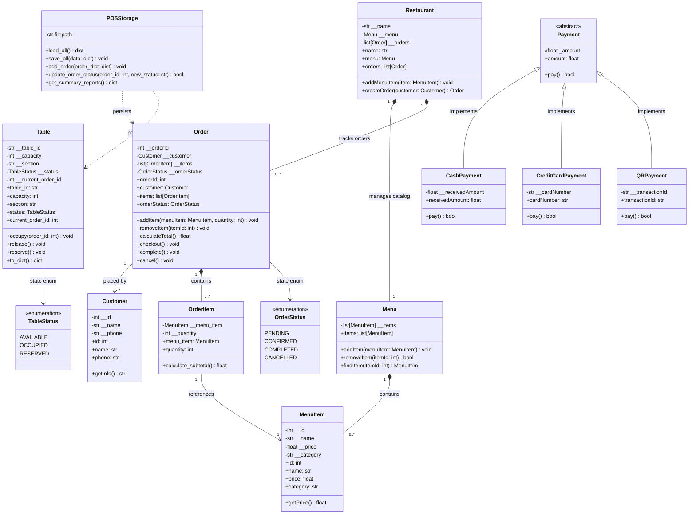
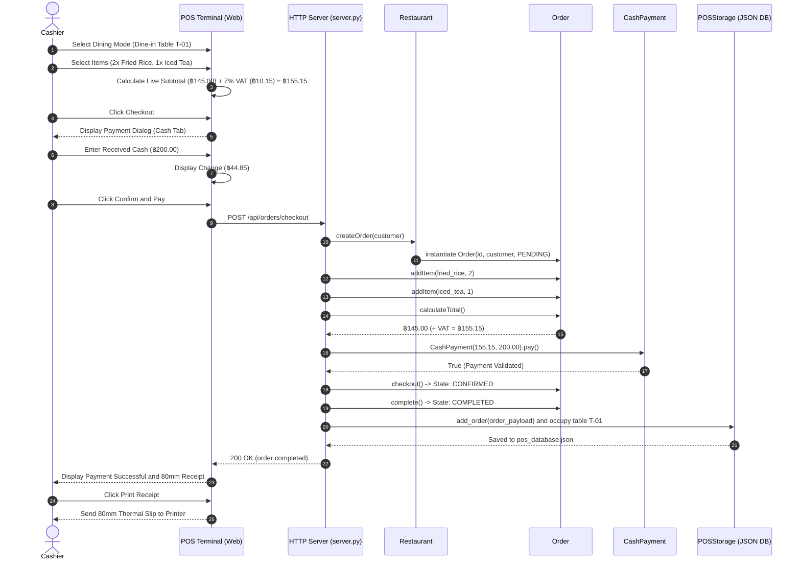
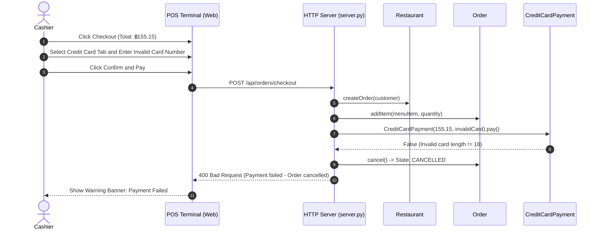
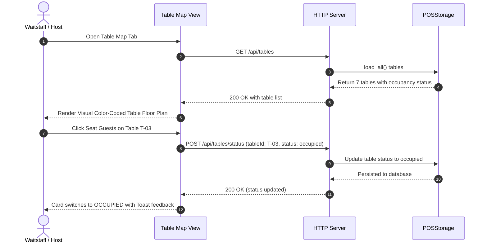

# 📐 TableOne Restaurant POS: UML Diagrams

This document contains the complete visual UML models for the TableOne Restaurant POS system, including **Use Case Diagrams**, **Class Diagrams**, and **Sequence Diagrams**.

---

## 1. Use Case Diagram

The use case diagram models the interactions between the system actors (**Customer**, **Cashier / Waitstaff**, **Restaurant Manager**, and **Kitchen / Bar Staff**) and the primary business functions of the POS system.

---

## 2. Detailed Class Diagram

The class diagram captures the object-oriented structure of the domain model, encapsulation, inheritance hierarchies, and data persistence associations.

---

## 3. Sequence Diagrams

### 3.1 Successful Order, Cash Payment & Completion (Happy Path)

This diagram details the primary order lifecycle from creation through item aggregation, total computation, cash tendering with change calculation, receipt rendering, and database persistence.

---

### 3.2 Failed Payment & Order Cancellation (Alternative Path)

This diagram illustrates the error-handling flow when a payment tender fails (e.g., insufficient cash or invalid credit card number).

---

### 3.3 Table Floor Management Sequence

This diagram shows how table occupancy is updated and synchronized between the UI, server, and persistent database.

