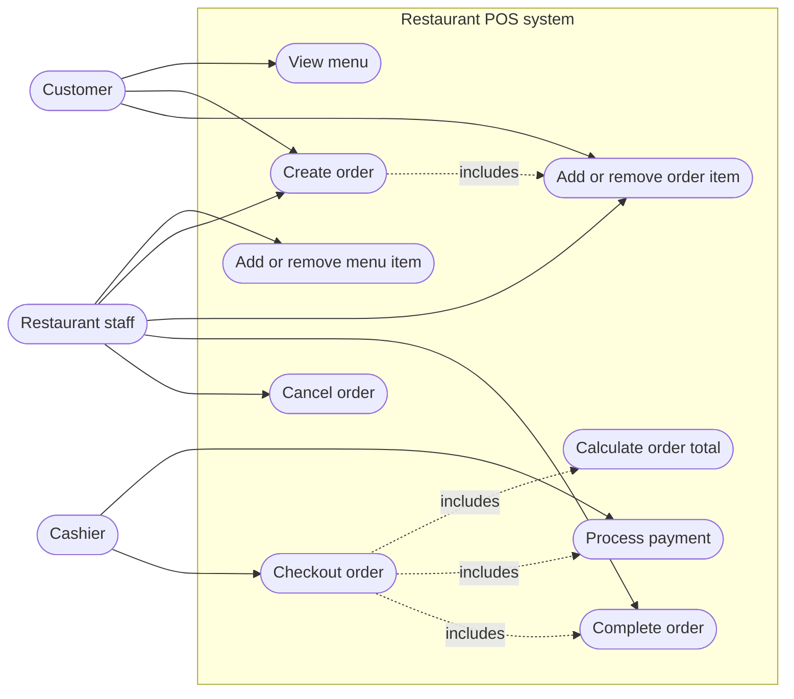
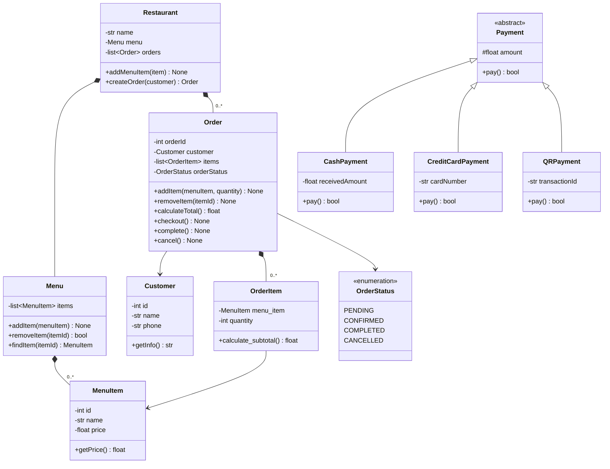
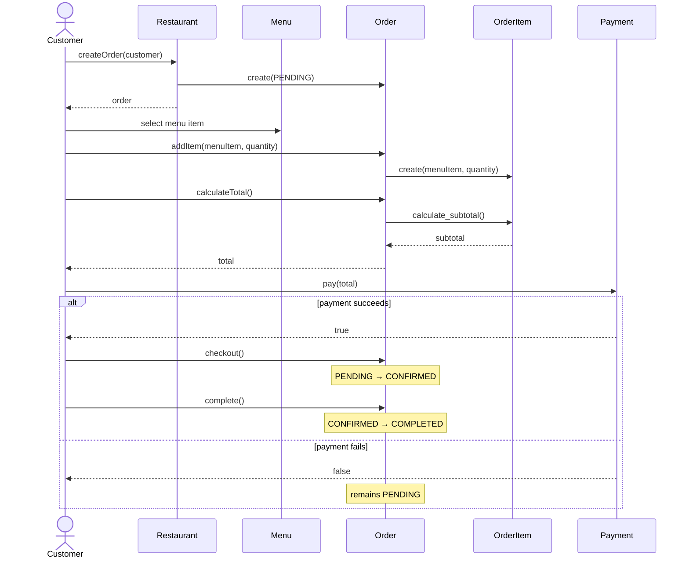

# Restaurant POS diagrams

## Use-case diagram

```mermaid
flowchart LR
    Customer([Customer])
    Staff([Restaurant staff])
    Cashier([Cashier])

    subgraph POS[Restaurant POS system]
        ViewMenu([View menu])
        ManageMenu([Add or remove menu item])
        CreateOrder([Create order])
        UpdateOrder([Add or remove order item])
        CalculateTotal([Calculate order total])
        ProcessPayment([Process payment])
        Checkout([Checkout order])
        CompleteOrder([Complete order])
        CancelOrder([Cancel order])
    end

    Customer --> ViewMenu
    Customer --> CreateOrder
    Customer --> UpdateOrder
    Staff --> ManageMenu
    Staff --> CreateOrder
    Staff --> UpdateOrder
    Cashier --> ProcessPayment
    Cashier --> Checkout
    Staff --> CompleteOrder
    Staff --> CancelOrder

    CreateOrder -. includes .-> UpdateOrder
    Checkout -. includes .-> CalculateTotal
    Checkout -. includes .-> ProcessPayment
    Checkout -. includes .-> CompleteOrder
```

## Class diagram

```mermaid
classDiagram
    class Customer {
        -int id
        -str name
        -str phone
        +getInfo() str
    }

    class MenuItem {
        -int id
        -str name
        -float price
        +getPrice() float
    }

    class Menu {
        -list~MenuItem~ items
        +addItem(menuItem) None
        +removeItem(itemId) bool
        +findItem(itemId) MenuItem
    }

    class OrderItem {
        -MenuItem menu_item
        -int quantity
        +calculate_subtotal() float
    }

    class OrderStatus {
        <<enumeration>>
        PENDING
        CONFIRMED
        COMPLETED
        CANCELLED
    }

    class Order {
        -int orderId
        -Customer customer
        -list~OrderItem~ items
        -OrderStatus orderStatus
        +addItem(menuItem, quantity) None
        +removeItem(itemId) None
        +calculateTotal() float
        +checkout() None
        +complete() None
        +cancel() None
    }

    class Restaurant {
        -str name
        -Menu menu
        -list~Order~ orders
        +addMenuItem(item) None
        +createOrder(customer) Order
    }

    class Payment {
        <<abstract>>
        #float amount
        +pay() bool
    }

    class CashPayment {
        -float receivedAmount
        +pay() bool
    }

    class CreditCardPayment {
        -str cardNumber
        +pay() bool
    }

    class QRPayment {
        -str transactionId
        +pay() bool
    }

    Restaurant *-- Menu
    Restaurant *-- "0..*" Order
    Menu *-- "0..*" MenuItem
    Order --> Customer
    Order *-- "0..*" OrderItem
    OrderItem --> MenuItem
    Order --> OrderStatus
    Payment <|-- CashPayment
    Payment <|-- CreditCardPayment
    Payment <|-- QRPayment
```

## Sequence diagram: create, pay for, and complete an order

```mermaid
sequenceDiagram
    actor Customer
    participant Restaurant
    participant Menu
    participant Order
    participant OrderItem
    participant Payment

    Customer->>Restaurant: createOrder(customer)
    Restaurant->>Order: create(PENDING)
    Restaurant-->>Customer: order
    Customer->>Menu: select menu item
    Customer->>Order: addItem(menuItem, quantity)
    Order->>OrderItem: create(menuItem, quantity)
    Customer->>Order: calculateTotal()
    Order->>OrderItem: calculate_subtotal()
    OrderItem-->>Order: subtotal
    Order-->>Customer: total

    Customer->>Payment: pay(total)
    alt payment succeeds
        Payment-->>Customer: true
        Customer->>Order: checkout()
        Note over Order: PENDING → CONFIRMED
        Customer->>Order: complete()
        Note over Order: CONFIRMED → COMPLETED
    else payment fails
        Payment-->>Customer: false
        Note over Order: remains PENDING
    end
```
