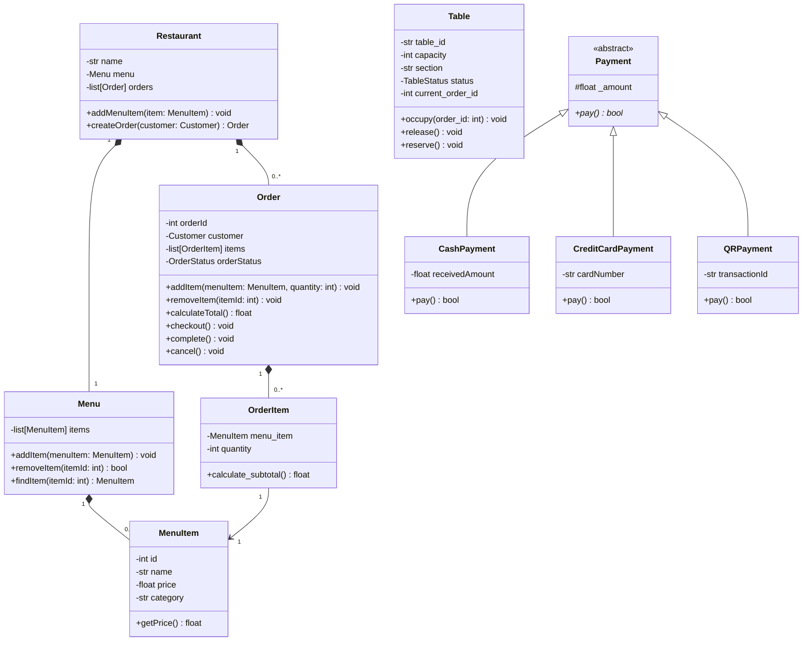
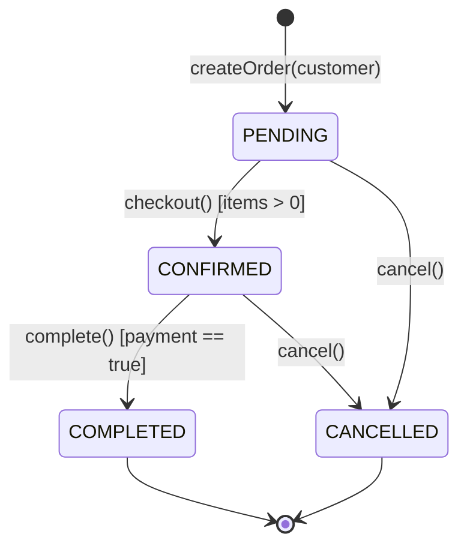

# Architecture & Technical Design Document

## 1. Architectural Principles

The **TableOne Restaurant POS System** is architected around **Domain-Driven Design (DDD)** and **Specification-Driven Development (SDD)** principles:

1. **Explicit Domain Boundaries**: Core business rules (order totals, status transitions, payment validation) are encapsulated purely in object-oriented domain classes with zero framework dependencies.
2. **Polymorphic Extensibility**: Payment processing is structured using the Strategy/Subtype Polymorphism pattern, allowing new payment methods (e.g., Apple Pay, gift cards) to be introduced without modifying existing checkout routines.
3. **Fail-Closed State Invariants**: Orders cannot be mutated after checkout, empty orders cannot be checked out, and completed orders cannot be cancelled.
4. **Resilient Persistence**: Lightweight file-backed JSON database (`storage.py`) providing zero-configuration data persistence across restarts with offline fallback on the frontend.

---

## 2. Domain Model Architecture



---

## 3. Order Lifecycle State Machine

The order lifecycle adheres strictly to finite state transitions:



### Invariant Rules
- **Non-Empty Cart**: `checkout()` verifies `len(self.__items) > 0`; otherwise raises `ValueError("Order is empty")`.
- **Status Guards**: `complete()` requires `OrderStatus.CONFIRMED`.
- **Cancellation Lock**: `cancel()` rejects cancellation once an order is in `OrderStatus.COMPLETED`.
- **Item Mutation Lock**: `addItem()` and `removeItem()` require `OrderStatus.PENDING`. Adding or removing items from confirmed or completed orders is blocked.
- **Positive Quantity Invariant**: `OrderItem` enforces `quantity > 0` on construction.

---

## 4. Payment Subsystem Design

All payment types inherit from the abstract base class `Payment`:

```python
class Payment(ABC):
    def __init__(self, amount: float):
        self._amount = amount

    @property
    def amount(self) -> float:
        return self._amount

    @abstractmethod
    def pay(self) -> bool:
        pass
```

- **CashPayment**: Evaluates `receivedAmount >= amount`. Computes change `receivedAmount - amount`.
- **CreditCardPayment**: Sanitizes non-numeric characters and verifies standard 16-digit card strings. Masks card output as `****-****-****-XXXX`.
- **QRPayment**: Validates presence of a non-empty `transactionId`.

---

## 5. Persistence Subsystem (`storage.py`)

The persistence engine abstracts read/write interactions to `data/pos_database.json`:
- **Auto-Initialization**: If the JSON database is missing or corrupt, it initializes with verified default seed menus and tables.
- **Atomic Serialization**: High-level atomic read/write using Python's standard `json` module.
- **Audit Logging**: Every completed order is stamped with timestamp, customer info, table number, dining mode, item breakdown, and payment details.
