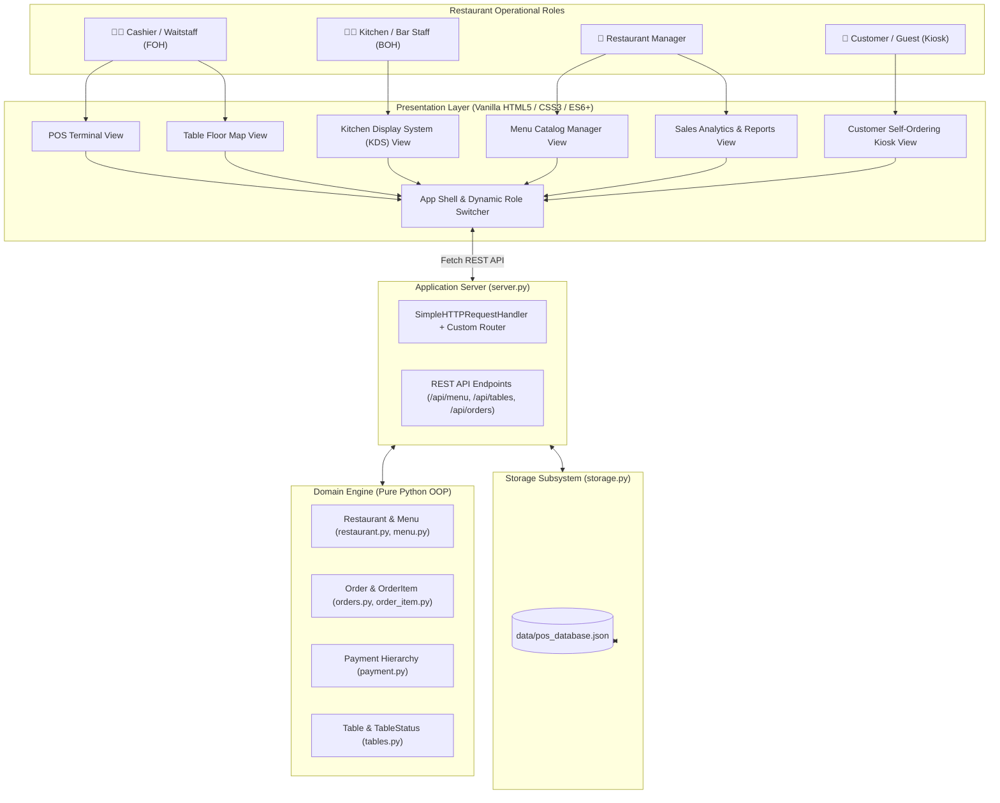
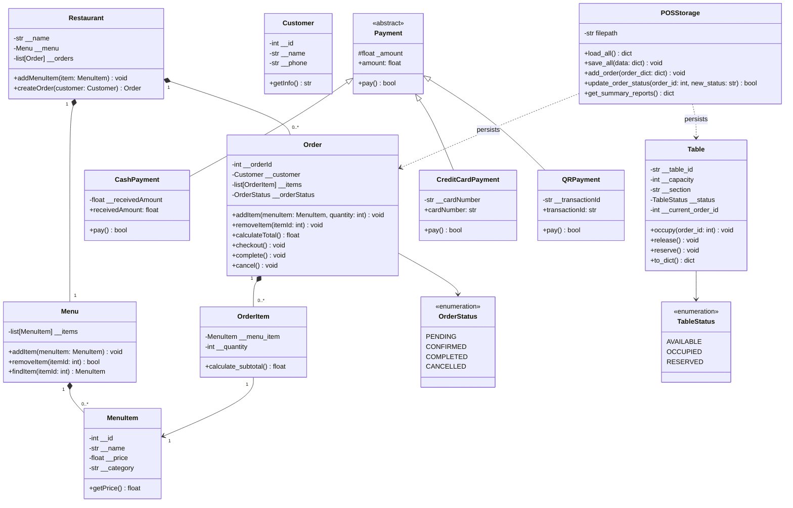
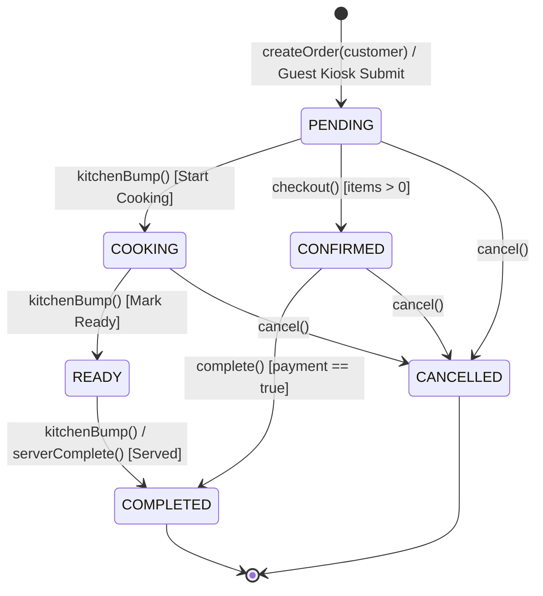

# Architecture & Technical Design Document

## 1. Architectural Principles

The **TableOne Restaurant POS System** is architected around **Domain-Driven Design (DDD)** and **Specification-Driven Development (SDD)** principles:

1. **Explicit Domain Boundaries**: Core business rules (order totals, status transitions, payment validation, table allocations) are encapsulated purely in object-oriented domain classes with zero third-party dependencies.
2. **Polymorphic Extensibility**: Payment processing is structured using the Strategy / Subtype Polymorphism pattern, allowing new payment methods (e.g., Apple Pay, gift cards) to be introduced without modifying existing checkout routines.
3. **Fail-Closed State Invariants**: Orders cannot be mutated after checkout, empty orders cannot be checked out, completed orders cannot be cancelled, and item quantities must be strictly positive integers.
4. **Multi-Role User Experience**: Dedicated UI workflows tailored specifically for each restaurant persona: Front-of-House (Cashier/Waitstaff), Back-of-House (Kitchen Display System), Management (Analytics & Catalog), and Guests (Self-Ordering Kiosk).
5. **Resilient Persistence**: Lightweight file-backed JSON database (`storage.py`) providing zero-configuration data persistence across restarts with offline fallback on the frontend.

---

## 2. Multi-Role System Architecture

---

## 3. Domain Model Architecture

---

## 4. Order Lifecycle & Kitchen State Machine

Orders adhere strictly to finite state transitions:

### Invariant Rules
- **Non-Empty Cart**: `checkout()` verifies `len(self.__items) > 0`; otherwise raises `ValueError("Order is empty")`.
- **Status Guards**: Direct transition from `PENDING` to `COMPLETED` is rejected; an order must be confirmed before completion.
- **Cancellation Lock**: `cancel()` rejects cancellation once an order reaches `OrderStatus.COMPLETED`.
- **Item Mutation Lock**: `addItem()` and `removeItem()` require `OrderStatus.PENDING`. Mutating locked orders raises `RuntimeError`.
- **Positive Quantity Invariant**: `OrderItem` validates `quantity > 0` on construction.

---

## 5. Payment Subsystem Design

All payment types inherit from the abstract base class `Payment`:

- **CashPayment**: Evaluates `receivedAmount >= amount`. Computes change `receivedAmount - amount`.
- **CreditCardPayment**: Sanitizes non-numeric characters and verifies standard 16-digit card strings. Masks card output as `****-****-****-XXXX`.
- **QRPayment**: Validates presence of a non-empty `transactionId`.
- **Counter Payment**: Dedicated checkout pathway enabling customer self-orders from tabletop kiosks to enter the kitchen queue for post-meal settlement.

---

## 6. Persistence Subsystem (`storage.py`)

The persistence engine manages file I/O for `data/pos_database.json`:
- **Auto-Initialization**: Missing or corrupted database files are automatically initialized with default seed menus and tables.
- **Atomic Serialization**: High-level atomic read/write using Python's standard `json` module.
- **Table Synchronization**: Table occupancy dynamically links to active order IDs and automatically releases when orders complete.
