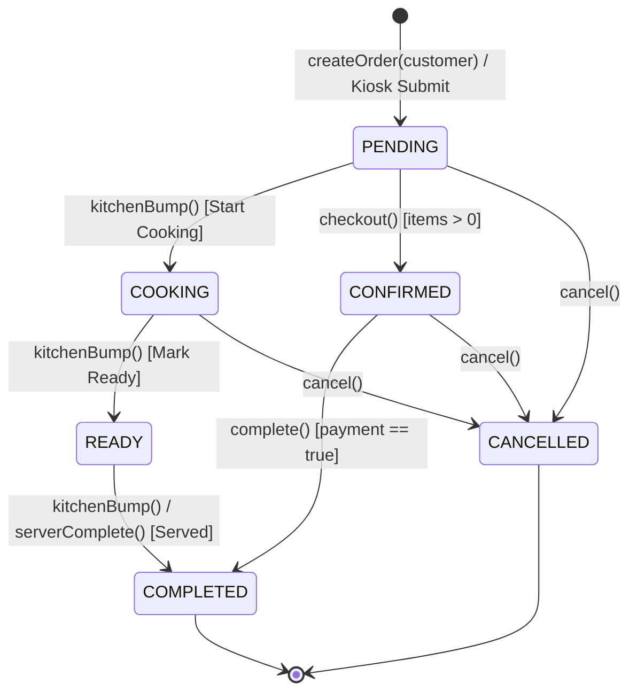
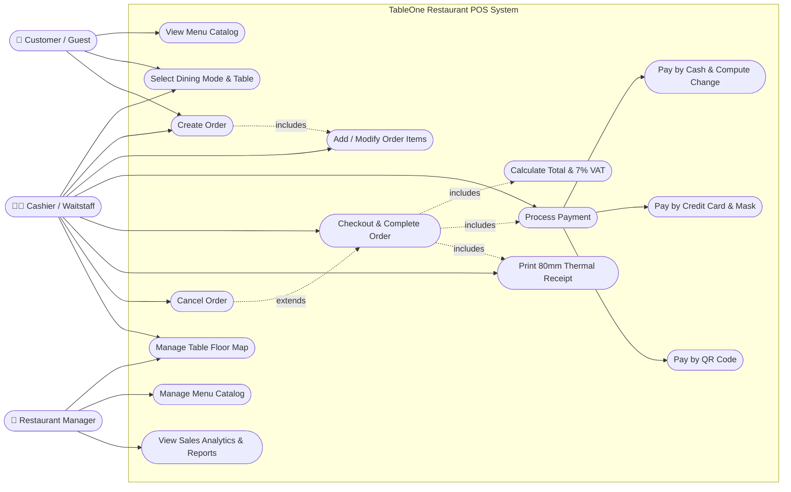
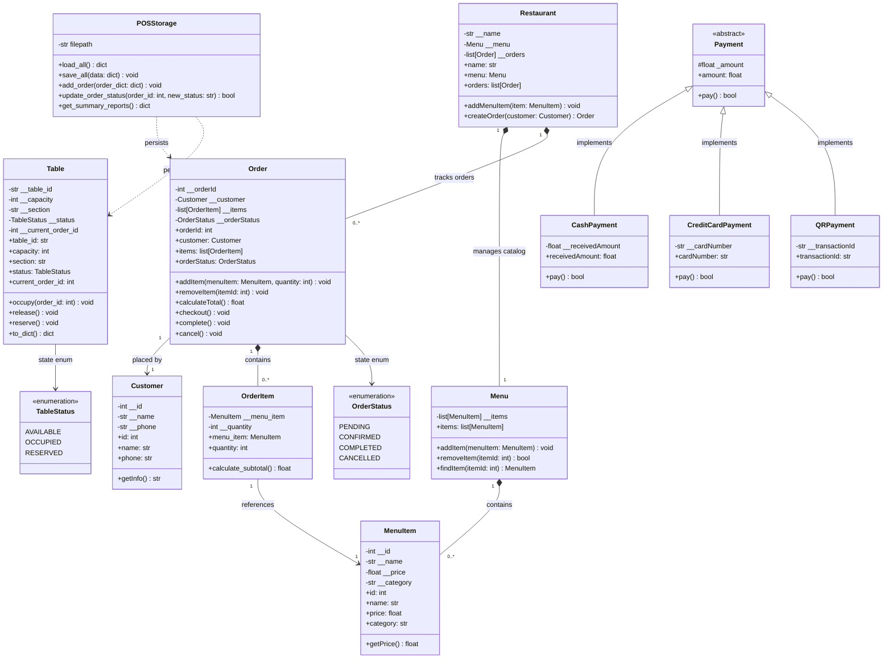
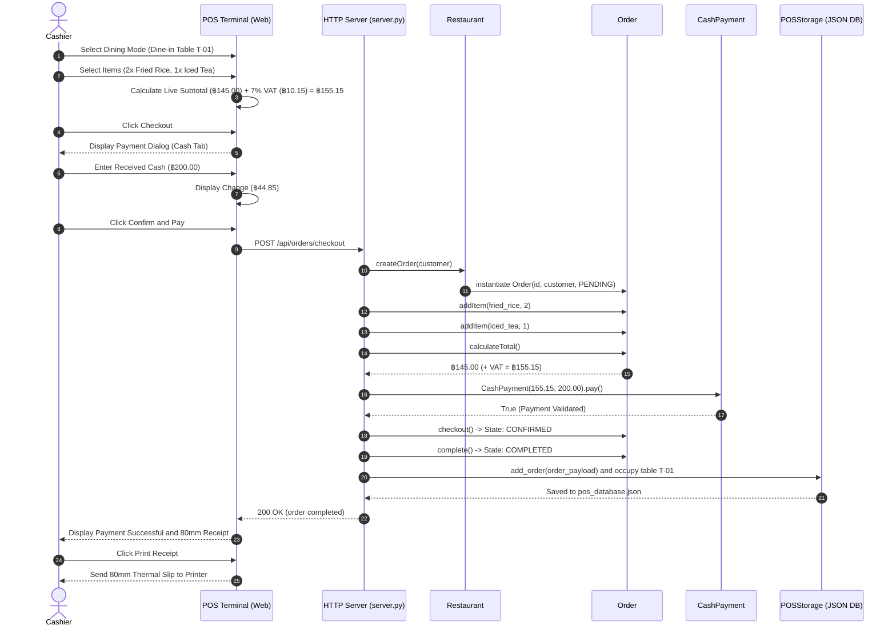
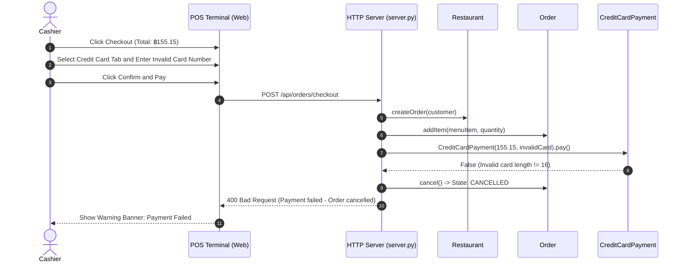
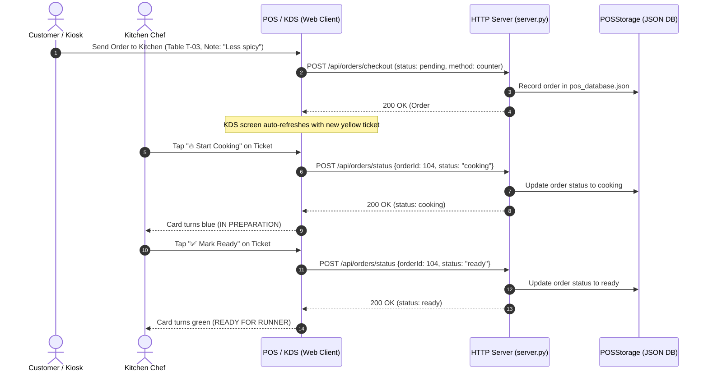
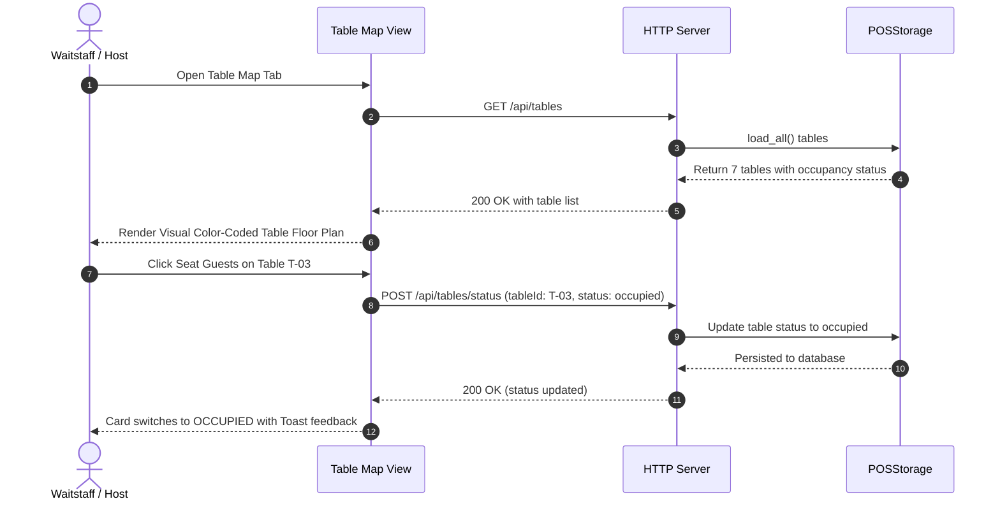

# 🍽️ TableOne Restaurant POS: Master System Documentation

> **Specification-Driven, Full-Stack Restaurant Point of Sale & Management Platform**  
> *Consolidated System Architecture, Visual UML Models, Multi-Role User Experience, REST API Reference, and Verification Matrix.*

---

## 📑 Table of Contents
1. [Executive Overview](#1-executive-overview)
2. [Specification-Driven Domain Models & Invariants](#2-specification-driven-domain-models--invariants)
3. [Multi-Role Architecture & User Interfaces](#3-multi-role-architecture--user-interfaces)
4. [Unified UML Visual Models](#4-unified-uml-visual-models)
   - 4.1 [Use Case Diagram](#41-use-case-diagram)
   - 4.2 [Detailed Class Diagram](#42-detailed-class-diagram)
   - 4.3 [Sequence Diagram: Happy Path Order & Cash Tender](#43-sequence-diagram-happy-path-order--cash-tender)
   - 4.4 [Sequence Diagram: Payment Failure & Cancellation](#44-sequence-diagram-payment-failure--cancellation)
   - 4.5 [Sequence Diagram: Kitchen Display System (KDS) Bump Flow](#45-sequence-diagram-kitchen-display-system-kds-bump-flow)
   - 4.6 [Sequence Diagram: Table Floor Map Synchronization](#46-sequence-diagram-table-floor-map-synchronization)
5. [Complete REST API Specification](#5-complete-rest-api-specification)
6. [Operational User Guide by Role](#6-operational-user-guide-by-role)
   - 6.1 [Cashier & Waitstaff (Front of House)](#61-cashier--waitstaff-front-of-house)
   - 6.2 [Kitchen & Bar Staff (Back of House / KDS)](#62-kitchen--bar-staff-back-of-house--kds)
   - 6.3 [Restaurant Manager & Administration](#63-restaurant-manager--administration)
   - 6.4 [Customer Self-Order Kiosk (Guest UI)](#64-customer-self-order-kiosk-guest-ui)
7. [Hardware & Thermal Printing Integration](#7-hardware--thermal-printing-integration)
8. [Persistence Subsystem & JSON Database Schema](#8-persistence-subsystem--json-database-schema)
9. [Automated Acceptance Testing Suite (43 Tests)](#9-automated-acceptance-testing-suite-43-tests)
10. [Deployment & Operations](#10-deployment--operations)

---

## 1. Executive Overview

**TableOne Restaurant POS** is an enterprise-grade, specification-driven restaurant management system. Designed for high operational tempo, tactile ergonomics, and reliability, TableOne operates with **zero external runtime dependencies** (built strictly on Python 3 standard library and vanilla modern web technologies).

### Core Capabilities
- **High-Velocity Cashier Terminal**: Instant dish lookup (`/`), quick tender bank notes, live change calculation, and `@media print` 80mm thermal receipts.
- **Kitchen Display System (KDS)**: Real-time ticket board with elapsed prep timers, station status bump bar (`Pending` → `Cooking` → `Ready` → `Complete`), and cooking notes.
- **Customer Self-Ordering Kiosk**: Guest-facing touch kiosk allowing dine-in table ordering or takeaway, customized cooking preferences, and instant dispatch to the kitchen queue.
- **Executive Management & Analytics**: Menu catalog CRUD (dish additions, category & pricing adjustments, deletions), daily gross sales KPIs, Average Order Value (AOV), and popularity leaderboards.
- **Table Floor Management**: Real-time tracking of indoor, window, outdoor, and VIP table occupancy linked directly to active order IDs.
- **Polymorphic Payments**: Extensible payment hierarchy for Cash (with change logic), Credit Card (16-digit verification and masking), QR Code PromptPay, and Pay at Counter.

---

## 2. Specification-Driven Domain Models & Invariants

Core business rules are implemented as pure Python object-oriented domain classes:

### 2.1 Order State Machine Invariants


1. **Non-Empty Cart Invariant**: An order cannot be checked out with zero items (`ValueError("Order is empty")`).
2. **Strict Mutation Guard**: Once an order transitions out of `PENDING` (into `CONFIRMED`, `COOKING`, or `COMPLETED`), calling `addItem()` or `removeItem()` raises `RuntimeError`.
3. **No Direct Completion**: Orders cannot transition directly from `PENDING` to `COMPLETED` without confirmation/checkout.
4. **Non-Reversible Completion**: Once marked `COMPLETED`, an order cannot be cancelled (`ValueError("Completed order cannot be cancelled")`).
5. **Strict Positive Quantity**: `OrderItem(menu_item, quantity)` enforces `quantity > 0`.
6. **7% Value-Added Tax (VAT)**: Tax is computed strictly as $\text{tax} = \text{subtotal} \times 0.07$ and grand total is $\text{subtotal} + \text{tax}$.

---

## 3. Multi-Role Architecture & User Interfaces

TableOne includes an interactive **Role Switcher** that immediately customizes views and user personas:

| Role | Operational Scope | Default View | Active Views Available |
| :--- | :--- | :--- | :--- |
| **🧑‍💼 Cashier / Waitstaff** | Front of House (FOH) | Point of Sale | POS Terminal, Table Map, Order History |
| **👨‍🍳 Kitchen / Bar Staff** | Back of House (BOH) | Kitchen Display | Kitchen Display System (KDS), Order History |
| **👔 Restaurant Manager** | Operations & Admin | Sales Analytics | Sales Analytics, Menu Manager, Table Map, POS, History |
| **📱 Customer / Guest** | Guest Self-Order | Guest Kiosk | Customer Self-Ordering Kiosk |

---

## 4. Unified UML Visual Models

### 4.1 Use Case Diagram



---

### 4.2 Detailed Class Diagram



---

### 4.3 Sequence Diagram: Happy Path Order & Cash Tender



---

### 4.4 Sequence Diagram: Payment Failure & Cancellation



---

### 4.5 Sequence Diagram: Kitchen Display System (KDS) Bump Flow



---

### 4.6 Sequence Diagram: Table Floor Map Synchronization



---

## 5. Complete REST API Specification

The TableOne server serves static assets and REST endpoints over HTTP on port `8000`:

| Endpoint | Method | Payload / Params | Status Codes | Description |
| :--- | :---: | :--- | :---: | :--- |
| `/api/menu` | `GET` | None | `200` | Lists all menu dishes with ID, name, price, and category. |
| `/api/menu` | `POST` | `{"name": str, "price": float, "category": str}` | `201`, `400` | Registers a new dish into the catalog and persistent database. |
| `/api/menu/:id` | `DELETE` | URL parameter `:id` | `200`, `404` | Discontinues and deletes dish from the menu catalog. |
| `/api/tables` | `GET` | None | `200` | Returns all 7 floor tables, capacities, sections, and occupancy. |
| `/api/tables/status` | `POST` | `{"tableId": str, "status": str}` | `200`, `404` | Updates table occupancy (`available`, `occupied`, `reserved`). |
| `/api/customers` | `GET` | None | `200` | Returns directory of registered customer profiles. |
| `/api/customers` | `POST` | `{"name": str, "phone": str}` | `201`, `400` | Adds customer to directory. |
| `/api/orders` | `GET` | None | `200` | Returns complete audit trail of active and completed orders. |
| `/api/orders/checkout` | `POST` | `{"customerName", "diningMode", "tableNumber", "notes", "items", "payment", "status"}` | `200`, `400` | Calculates totals + 7% VAT, validates tender, persists order. |
| `/api/orders/status` | `POST` | `{"orderId": int, "status": str}` | `200`, `404` | KDS status transition (`pending` → `cooking` → `ready` → `completed`). |
| `/api/reports/summary`| `GET` | None | `200` | Aggregated analytics: gross revenue, total completed orders, AOV, and top sellers. |

---

## 6. Operational User Guide by Role

### 6.1 Cashier & Waitstaff (Front of House)
- **Starting an Order**: Select Dining Mode (`🍽️ Dine-in` with table selector or `🥡 Takeaway`).
- **Assign Customer**: Click `👤 Guest Selector` for quick presets (*Walk-in*, *VIP Somchai*, *Apinya*) or type customer phone.
- **Search Dishes**: Tap dish cards or press **`/`** to jump straight to keyboard search.
- **Tender Options**:
  - *Cash*: Click `Exact`, `฿100`, `฿500`, or `฿1,000` to auto-calculate change.
  - *Credit Card*: Type 16 numeric digits (auto-masked).
  - *QR Code*: Verify PromptPay authorization code.
- **Receipts**: Click `🖨️ Print Receipt` to output an 80mm receipt, then `Start Next Order`.

### 6.2 Kitchen & Bar Staff (Back of House / KDS)
- **Live Ticket Monitoring**: Switch to **👨‍🍳 Kitchen** role. Tickets list order ID, table/takeaway status, elapsed timer, dish portions, and cooking notes.
- **Bump Actions**:
  - Unstarted tickets: Tap `🔥 Start Cooking`.
  - In-prep tickets: Tap `✅ Mark Ready`.
  - Plated tickets: Tap `🍽️ Served & Complete`.
- **Station Filtering**: Switch between `All Active`, `🔥 Pending`, `🍳 Cooking`, and `✅ Ready`.

### 6.3 Restaurant Manager & Administration
- **Sales Analytics (`📊 Reports`)**: Live gross sales, completed order tally, Average Order Value (AOV), and units sold by dish.
- **Menu Management (`🍴 Menu Manager`)**: Click `+ Add New Dish` to register dishes or click `🗑️ Delete` to remove discontinued items.
- **Table Floor Map (`🪑 Table Map`)**: Check table availability across Indoor, Window, Outdoor, and VIP sections.

### 6.4 Customer Self-Order Kiosk (Guest UI)
- **Guest Experience**: Switch to **📱 Kiosk** role.
- **Tray Building**: Tap category filters and tap `+ Add to Tray` on dish cards.
- **Special Cooking Requests**: Enter kitchen instructions in the notes field (*e.g., “No chili, extra crispy”*).
- **Direct Dispatch**: Tap `🚀 Send to Kitchen`. The order arrives immediately on the Kitchen KDS and reserves the selected table.

---

## 7. Hardware & Thermal Printing Integration

TableOne incorporates production-grade print stylesheets (`@media print`):
- **Printer Compatibility**: Epson TM-T88, Star Micronics TSP100, Sunmi POS terminals, and any standard 80mm thermal receipt printer.
- **Page Dimensions**: Fixed $80\text{mm}$ roll width with $72\text{mm}$ printable text boundaries.
- **Visual Optimization**: Screen chrome, sidebar, and buttons are automatically hidden. Monospace receipt typography renders crisp barcodes, VAT breakdown, and change calculations.

---

## 8. Persistence Subsystem & JSON Database Schema

System state is stored atomically in `data/pos_database.json`:

```json
{
  "menu": [
    { "id": 1, "name": "Fried Rice (ข้าวผัด)", "price": 60.0, "category": "mains" }
  ],
  "tables": [
    { "tableId": "T-01", "capacity": 2, "section": "Indoor", "status": "available", "currentOrderId": null }
  ],
  "orders": [
    {
      "orderId": 101,
      "customer": { "name": "Walk-in Guest", "phone": "" },
      "diningMode": "dinein",
      "tableNumber": "T-01",
      "notes": "Less spicy",
      "items": [{ "id": 1, "name": "Fried Rice (ข้าวผัด)", "price": 60.0, "quantity": 2, "subtotal": 120.0 }],
      "subtotal": 120.0,
      "tax": 8.4,
      "total": 128.4,
      "status": "completed",
      "paymentMethod": "Cash",
      "timestamp": "2026-09-09 14:00:00"
    }
  ],
  "customers": [
    { "id": 1, "name": "Walk-in Guest", "phone": "" }
  ],
  "next_order_id": 102
}
```

---

## 9. Automated Acceptance Testing Suite (43 Tests)

Every system invariant, state transition, and API endpoint is covered by automated specification tests:

```bash
python3 -m unittest discover -s tests -p "test_*.py" -v
```

| Test Suite | File | Tests | Coverage |
| :--- | :--- | :---: | :--- |
| **Menu Specification** | `test_menu_spec.py` | 4 | Adding, removing, property encapsulation, missing items. |
| **Order Specification** | `test_order_spec.py` | 14 | Totals calculation, item removal, positive quantity, checkout guards, state invariants. |
| **Payment Specification** | `test_payment_spec.py` | 10 | Exact & sufficient cash, 16-digit card validation, card string cleaning, PromptPay QR tokens. |
| **E2E Flow Specification** | `test_e2e_flow_spec.py` | 3 | Full happy path flow, payment failure cancellation flow, sequential order ID generation. |
| **Full System Specification**| `test_full_system_spec.py` | 7 | Table allocation/release, persistence serialization, Menu CRUD, report metrics. |
| **Server Specification** | `test_server_spec.py` | 2 | HTTP REST API GET /api/menu and POST /api/orders/checkout. |
| **Multi-Role Specification**| `test_role_coverage_spec.py`| 3 | Customer Kiosk dispatch, Kitchen KDS bump lifecycle, Manager analytics & catalog CRUD. |
| **Total Passed** | **7 Test Suites** | **43** | **100% Passing Acceptance Rate** |

---

## 10. Deployment & Operations

### Quick Start
```bash
# 1. Clone repository
git clone https://github.com/tudzydev/Restaurant-POS.git
cd Restaurant-POS

# 2. Run automated test suite
python3 -m unittest discover -s tests -p "test_*.py" -v

# 3. Launch HTTP server (defaults to port 8000)
python3 server.py 8000
```
Open **`http://localhost:8000`** in Google Chrome, Safari, or on a tablet device.
